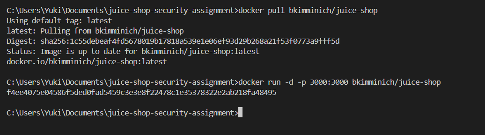

# Web Security Assignment - OWASP Juice Shop

## 環境說明

- 作業系統：Windows 11
- Docker version：v4.41.0

## 安裝與執行步驟

1. 安裝 Docker
2. 執行指令：`docker pull bkimminich/juice-shop`
3. 啟動容器：`docker run -p 3000:3000 bkimminich/juice-shop`
4. 瀏覽器開啟：http://localhost:3000

## 測試環境

- 完全在本機 Docker 容器中執行
- 未對任何公開或生產環境進行測試

## **Vulnerability Report Outline**

- 作業標題：Web Security Vulnerability Identification & Fixes
- 學生姓名/學號： 113598037 陳宥錡
- 使用平台：OWASP Juice Shop

#### 目錄

1. Executive Summary (摘要)
2. Environment Setup (環境設定)
3. Vulnerability Analysis (漏洞分析)
4. Proposed Fixes (修復建議)
5. Verification Results (驗證結果)
6. Reflection (心得反思)
7. References (參考資料)

---

#### Executive Summary

- 簡述找到的漏洞類型（例如：SQL Injection）
- 風險等級（High/Medium/Low）
- 修復結果概述

#### Environment Setup

- Docker Pull
  
- Juice Shop Activate
  
- 測試環境規格說明
- 安全聲明（僅在隔離環境測試）

#### Vulnerability Analysis

##### Broken Acess Control

###### 漏洞描述

- 漏洞類型：Broken Acess Control
- 難度等級：[Beginner/Intermediate/Advanced]
- 影響範圍：[哪個功能/API endpoint]

###### 測試環境設定

- 建立了兩個測試帳號：
  - User1: user1@test.com (Basket ID: 6)
  - User2: user2@test.com (Basket ID: 7)

並分別在各自的購物籃中加入不同的商品：

- User1 購物籃：Apple Juice, Apple Pomance
- User2 購物籃：Carrot Juice, Eggfruit Juice, Fruit Press


3.3 漏洞驗證

當我以 User2 身份登入時，透過修改 API 請求參數：

```
fetch('http://localhost:3000/rest/basket/6', {
  headers: {
    'Authorization': 'Bearer ' + localStorage.getItem('token')
  }
})
.then(r => r.json())
.then(data => console.log(data));
```

成功取得了 User1 的購物籃商品列表完整內容


###### Proposed Fixes

修復說明  
 [basket-acess-cinntrol-fix.md](./code-fixes/basket-access-control-fix.md)

修復核心 (`Step 5`)

```typescript
if (basket.id !== currentUser.bid) {
  return res.status(403).json({
    message: "Access denied: You can only access your own basket",
  });
}
```

❓❔ 為什麼變安全

1. **可信任的用戶身份來源**:

   - `currentUser.bid` 來自伺服器端維護的已驗證用戶 session
   - 不依賴 client 端可能被篡改的資料

2. **強制授權檢查**:

   - 每次請求都必須通過授權檢查
   - 即使攻擊者知道其他人的 basket ID，也無法繞過

3. **最小權限原則**:
   - 用戶只能存取自己的 basket
   - 不給予任何多餘的權限
