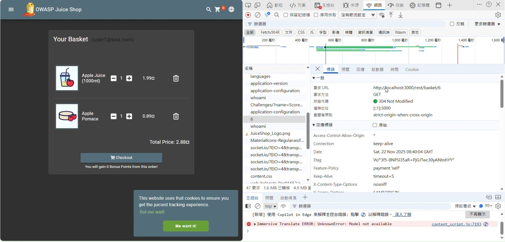
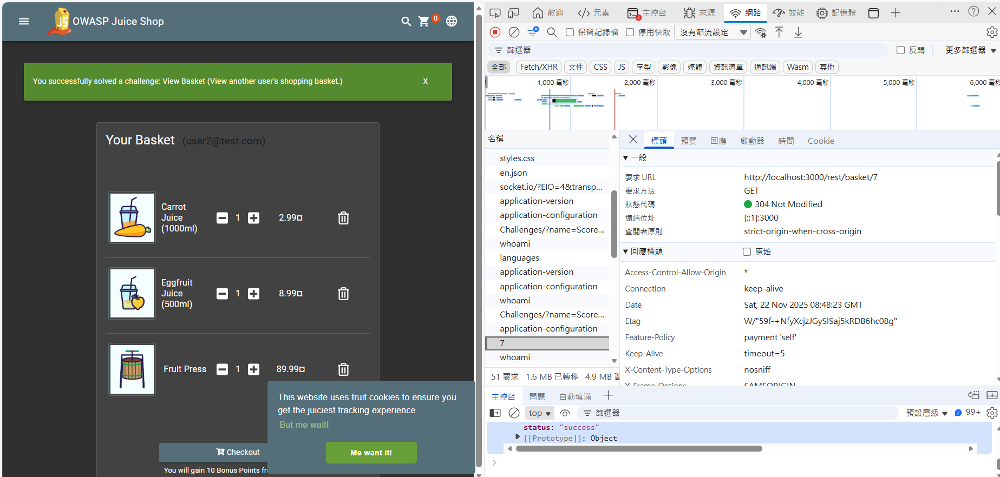
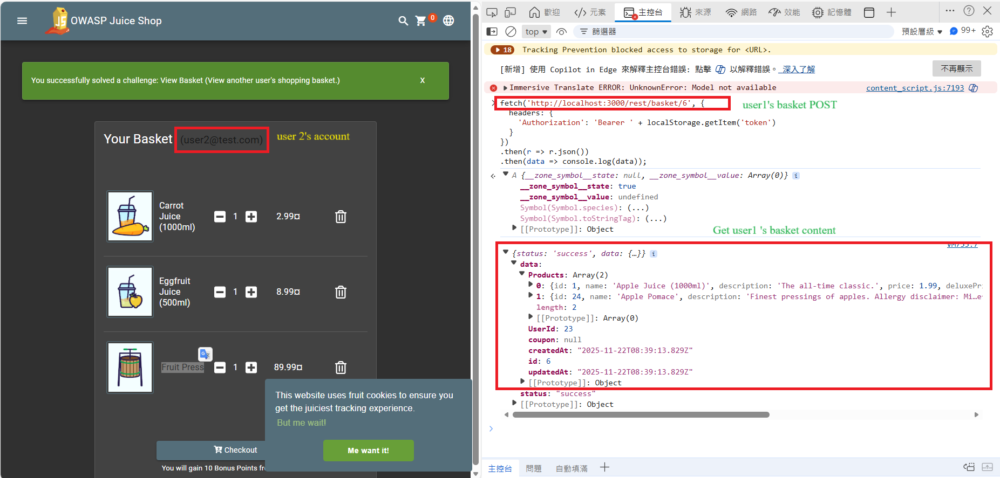

### Basket Acess Control

#### 漏洞描述

- 漏洞類型：Broken Acess Control
- 難度等級：Beginner

#### 漏洞位置

file: `routes/basket.ts`  
API Endpoint: `GET rest/basket/[BASKET_ID]`

###### 測試環境設定

- 建立了兩個測試帳號：
  - User1: user1@test.com (Basket ID: 6)
  - User2: user2@test.com (Basket ID: 7)

並分別在各自的購物籃中加入不同的商品：

- User1 購物籃：Apple Juice, Apple Pomance
- User2 購物籃：Carrot Juice, Eggfruit Juice, Fruit Press




###### 漏洞驗證

當我以 User2 身份登入時，透過修改 API 請求參數：

```
fetch('http://localhost:3000/rest/basket/6', {
  headers: {
    'Authorization': 'Bearer ' + localStorage.getItem('token')
  }
})
.then(r => r.json())
.then(data => console.log(data));
```

成功取得了 User1 的購物籃商品列表完整內容



###### Proposed Fixes

> 原始不安全程式碼

```typescript
export function retrieveBasket() {
  return (req: Request, res: Response, next: NextFunction) => {
    const id = req.params.id;
    //Problem: 沒有核對是否屬於當前的User即返回basket
    BasketModel.findOne({
      where: { id },
      include: [{ model: ProductModel, paranoid: false, as: "Products" }],
    })
      .then((basket: BasketModel | null) => {
        /* jshint eqeqeq:false */
        challengeUtils.solveIf(challenges.basketAccessChallenge, () => {
          const user = security.authenticatedUsers.from(req);
          return (
            user &&
            id &&
            id !== "undefined" &&
            id !== "null" &&
            id !== "NaN" &&
            user.bid &&
            user?.bid != parseInt(id, 10)
          ); // eslint-disable-line eqeqeq
        });
        if (basket?.Products != null && basket.Products.length > 0) {
          for (let i = 0; i < basket.Products.length; i++) {
            basket.Products[i].name = req.__(basket.Products[i].name);
          }
        }

        res.json(utils.queryResultToJson(basket));
      })
      .catch((error: Error) => {
        next(error);
      });
  };
}
```

> 修復的程式碼

```typescript
export function retrieveBasket() {
  return (req: Request, res: Response, next: NextFunction) => {
    const id = req.params.id;

    // Step 1: retrieve information about the currently logged-in user
    const currentUser = security.authenticatedUsers.from(req);

    // Step 2: verify whether the user is logged in
    if (!currentUser || !currentUser.bid) {
      return res.status(401).json({
        status: "error",
        message: "Authentication required",
      });
    }

    BasketModel.findOne({
      where: { id },
      include: [{ model: ProductModel, paranoid: false, as: "Products" }],
    })
      .then((basket: BasketModel | null) => {
        // Step 3: check whether the basket is exist
        if (!basket) {
          return res.status(404).json({
            status: "error",
            message: "Basket not found",
          });
        }

        //Step 4: check authorization
        //compare the basket owner ID with the current user's basket ID
        if (basket.id !== currentUser.bid) {
          // Log unauthorized access attempts for security monitoring
          console.warn({
            event: "UNAUTHORIZED_BASKET_ACCESS_ATTEMPT",
            userId: currentUser.id,
            userBasketId: currentUser.bid,
            attemptedBasketId: id,
            timestamp: new Date().toISOString(),
            ip: req.ip,
          });

          return res.status(403).json({
            status: "error",
            message: "Access denied: You can only access your own basket",
          });
        }

        // Step 5: if all checks pass, return the data
        if (basket.Products && basket.Products.length > 0) {
          for (let i = 0; i < basket.Products.length; i++) {
            basket.Products[i].name = req.__(basket.Products[i].name);
          }
        }
        res.json(utils.queryResultToJson(basket));
      })
      .catch((error: Error) => {
        next(error);
      });
  };
}
```

修復核心 (`Step 5`)

```typescript
if (basket.id !== currentUser.bid) {
  return res.status(403).json({
    message: "Access denied: You can only access your own basket",
  });
}
```

❓❔ 為什麼變安全

1. **可信任的用戶身份來源**:

   - `currentUser.bid` 來自伺服器端維護的已驗證用戶 session
   - 不依賴 client 端可能被篡改的資料

2. **強制授權檢查**:

   - 每次請求都必須通過授權檢查
   - 即使攻擊者知道其他人的 basket ID，也無法繞過

3. **最小權限原則**:
   - 用戶只能存取自己的 basket
   - 不給予任何多餘的權限
